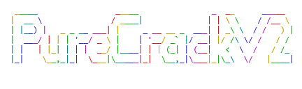

# Wellcome to PureCrackV2
## 🪟This program is only for windows🪟

### What is it
PureCrack is a remote access program talking over wifi, **now with passkey verification!!!**

### Using
Sooooo,⚠️ **please do not use this maliciously and if you do i'm not responsible for things caused to machines** ⚠️, and don't even use it normaly at home, just for testing and fun, it's not safe cause anyone can do anything, but it's fun!

#### Downloading
First open CMD and run :
```bash
cd Documents
git clone https://github.com/prankapple/PureCrackV2.git
cd PureCrackV2
pip install flask requests
```

#### Running
Run this in the same CMD :
```bash
python PureCrackV2.py
```

Now you can select 1 or 2 :

1 > Starts a PureCrack server on your machine

2 > Connects to a PureCrack server
